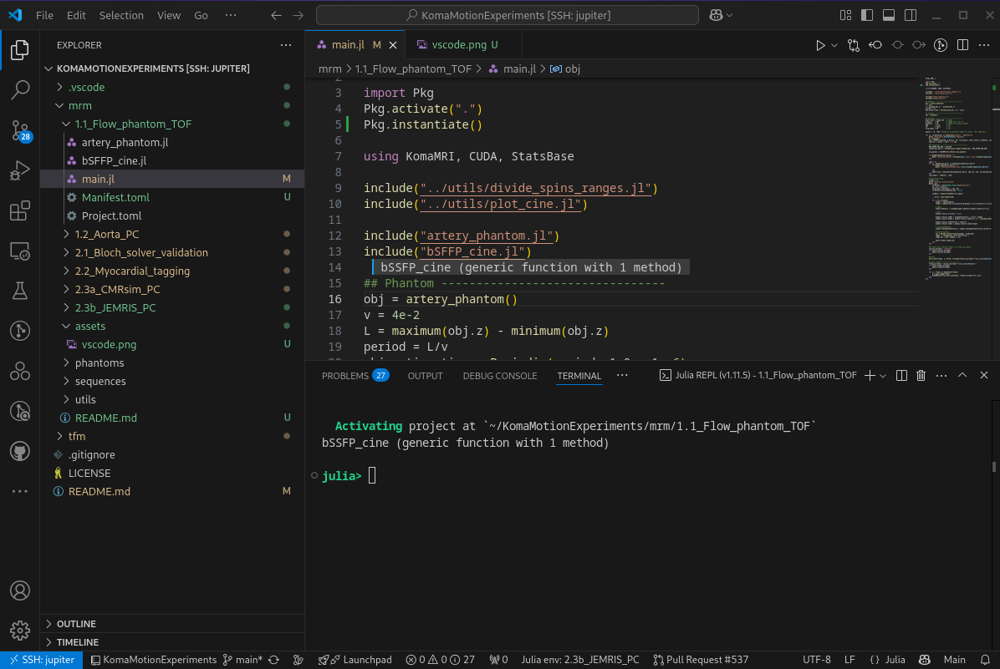

# Versatile and Highly Efficient MRI Simulations of Arbitrary Motion in KomaMRI

This folder contains the code neccesary to recreate the experiments conducted in Sections 2.4 and 3 of:

Villacorta-Aylagas P, Castillo-Passi C, Kierulf R, Menchón-Lara RM, Rodríguez-Galván JR, Sierra-Pallares J, Irarrazaval P, Alberola-López C. **Versatile and Highly Efficient MRI Simulations of Arbitrary Motion in KomaMRI**. *(submitted to Magn Reson Med)*. 2025. \
[https://doi.org/10.1002/mrm.70145](https://doi.org/10.1002/mrm.70145)

## List of experiments

### 1. Demonstrative Experiments

- **[1.1: Time of Flight (TOF) over a user-defined flow phantom](https://github.com/pvillacorta/KomaMotionExperiments/tree/main/mrm/1.1_Flow_phantom_TOF)**

    2D cine acquisition of a flow cylinder phantom, in which Time of Flight (TOF) effect is demonstrated.

- **[1.2: Phase Contrast (PC) on an aorta model](https://github.com/pvillacorta/KomaMotionExperiments/tree/main/mrm/1.2_Aorta_PC)**

    This section contains a Phase Constrast (PC) experiment over a realistic aorta phantom, whose velocities were extracted from the [Vascular Model Repository](https://www.vascularmodel.com/).


### 2. Comparative Experiments

- **[2.1: Validation of the Bloch solver under flow motion conditions](https://github.com/pvillacorta/KomaMotionExperiments/tree/main/mrm/2.1_Bloch_solver_validation)**

    This experiment recreates the one oconducted in Section 4.1 from:

    Puiseux T, Sewonu A, Moreno R, Mendez S, Nicoud F. **Numerical simulation of time-resolved 3D phase-contrast magnetic resonance imaging**. *PLOS ONE* 2021 16(3).
    https://doi.org/10.1371/journal.pone.0248816 

- **[2.2: Myocardial tagging over a user-defined phantom](https://github.com/pvillacorta/KomaMotionExperiments/tree/main/mrm/2.2_Myocardial_tagging)**

    2D cine tagging acquisition, which recreates the tagging experiment conducted in:

    Xanthis CG, Venetis IE, Aletras AH. **High performance MRI simulations of motion on multi-GPU systems**. *J Cardiovasc Magn Reson*. 2014 Jul 4;16(1):48.
    https://doi.org/10.1186/1532-429X-16-48

- **[2.3a: Turbulent flow with velocity encoded spoiled GRE](https://github.com/pvillacorta/KomaMotionExperiments/tree/main/mrm/2.3a_CMRsim_PC)**

    Spoiled GRE PC acquisition over a stenotic U-bend flow phantom. 
    This recreates the experiment carried out in Sections 2.8.1 and 3.2 from:

    Weine J, McGrath C, Dirix P, Buoso S, Kozerke S. **CMRsim–A python package for cardiovascular MR simulations incorporating complex motion and flow**. *Magn Reson Med*. 2024; 91: 2621-2637.
    https://doi.org/10.1002/mrm.30010


- **[2.3b: PC-GRE over two parallel tubes with opposite flow directions](https://github.com/pvillacorta/KomaMotionExperiments/tree/main/mrm/2.3b_JEMRIS_PC)**

    Spoiled GRE PC acquisition over a phantom consisting of two parallel tubes with opposite flow directions, one of which is surrounded by static tissue.
    This recreates the experiment conducted in Section 3.3.6 from:

    Fortin A, Salmon S, Baruthio J, Delbany M, Durand E. **Flow MRI simulation in complex 3D geometries: Application to the cerebral venous network**. *Magn Reson Med*. 2018; 80: 1655–1665. 
    https://doi.org/10.1002/mrm.27114 

## Other Directories

- [`/phantoms`](https://github.com/pvillacorta/KomaMotionExperiments/tree/main/mrm/phantoms): 

    This directory is intentionally left empty, as phantom files are too large to be stored on GitHub. Instead, they are hosted on [Zenodo](https://zenodo.org/records/15591102).

    These phantom files will be automatically downloaded and added to this directory as the corresponding experiments in the repository are executed. Specifically:

    - 1.2 Aorta PC: Downloads 'aorta_2M_spins.phantom'
    - 2.3a CMRsim PC: Downloads 'sUbend_1p5M_spins_turb.phantom' and 'sUbend_4M_spins_noturb.phantom'
    - 2.3b JEMRIS PC: Downloads 'fortin_2M_spins.phantom'

- [`/sequences`](https://github.com/pvillacorta/KomaMotionExperiments/tree/main/mrm/sequences):

    This directory contains Julia scripts that generate pulse sequences used for the experiments.

- [`/utils`](https://github.com/pvillacorta/KomaMotionExperiments/tree/main/mrm/utils): 

    Some utility scripts for loading phantoms, dividing them into parts with a maximum number of spins, and visualizing cine acquisitions.

## How To Use

### Requirements
- [Git](https://git-scm.com/book/en/v2/Getting-Started-Installing-Git). 
- [Julia](https://julialang.org/install/).
- (Recommended) [Visual Studio Code](https://code.visualstudio.com/download) with [Julia Extension](https://code.visualstudio.com/docs/languages/julia).

### How To Download and Run the Experiments

First, clone the repository to your local machine:
```bash
git clone https://github.com/pvillacorta/KomaMotionExperiments
cd KomaMotionExperiments/mrm
```

Then, `cd` into the directory of the experiment you want to reproduce.  
The available experiments are:

- `1.1_Flow_phantom_TOF`
- `1.2_Aorta_PC`
- `2.1_Bloch_solver_validation`
- `2.2_Myocardial_tagging`
- `2.3a_CMRsim_PC`
- `2.3b_JEMRIS_PC`

For example:
```bash
cd 1.1_Flow_phantom_TOF
```

Next, run the corresponding main.jl (or similar) script in that directory.
Each script will automatically activate its dedicated Julia environment and download the required phantom if necessary:

```bash
julia main.jl
```

or (preferred, as it is more interactive):


```bash
user@linux-desktop:~/path/to/KomaMotionExperiments/1.1_Flow_phantom_TOF$ julia
```
```julia-repl
julia> include("main.jl")
```

### Optional: Running from VSCode
For a more interactive experience, we recommend running the experiments from [Visual Studio Code (VSCode) using the Julia extension](https://code.visualstudio.com/docs/languages/julia).
This allows you to execute the scripts **line by line** `(Shift + Enter)` or **block by block** `(Alt + Shift + Enter)` directly from the Julia REPL:



In this case, it is recommended to restart Julia between running different experiments (i.e., when switching from one folder to another).
